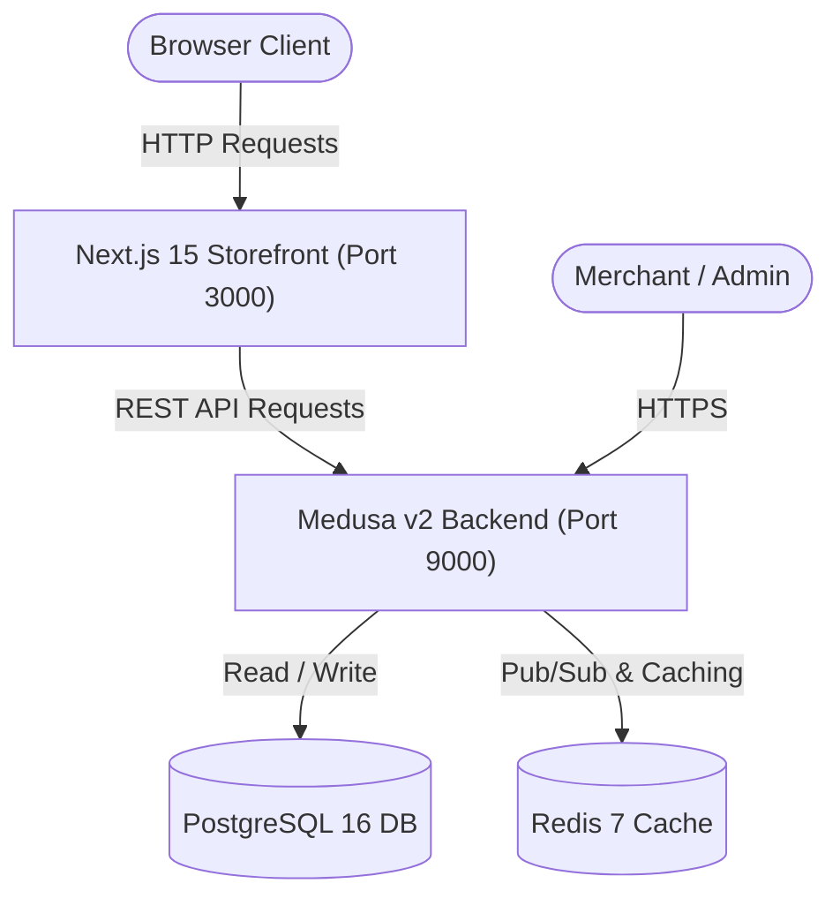

# System Architecture Documentation

This document outlines the high-level architecture, module boundaries, and technology stack of the Design Studio monorepo.

---

## 1. High-Level System Topology

The system uses a decoupled frontend-backend topology consisting of a Next.js 15 storefront, a Medusa v2 e-commerce core, and their associated data/caching stores.

---

## 2. Component Directory Breakdown

The codebase is organized as a Turborepo monorepo orchestrated with `pnpm` workspaces:

- **`apps/`**: Self-contained executable deployments.
  - `@dtc/backend`: The primary e-commerce server running Medusa v2 (core, database migrations, admin panel).
  - `@dtc/storefront`: The customer-facing Next.js 15 application utilizing the App Router and Tailwind CSS v4.
- **`packages/`**: Shared, non-publishable configuration modules.
  - `@dtc/typescript-config`: Centralized compiler rules (base, Node-specific, and Next.js-specific profiles).
  - `@dtc/eslint-config`: Shared linting profiles (base rules, Next.js configurations, and Medusa guidelines).
- **`infra/`**: Infrastructure configurations and Docker orchestration scripts.

---

## 3. Key Design Decisions

### 3.1. Monorepo Orchestration via Turborepo & pnpm

- **Decision**: Run packages in a unified workspace managed by Turborepo.
- **Rationale**: Ensures fast build caching, parallel task execution (e.g. concurrent linting and typechecking), and single-lockfile dependency resolution across the entire stack.

### 3.2. Decentralized App compilation with Centralized Shared Configurations

- **Decision**: Extract configs (ESLint, TSConfig) into workspace packages under `packages/` and extend them within individual applications.
- **Rationale**: Standardizes coding styles, keeps individual app project files minimal, and reduces duplication.

### 3.3. Multi-Stage Docker Builds (Standalone Output)

- **Decision**: Enable Next.js `standalone` mode in production.
- **Rationale**: Minimizes docker image weight and network latency by copying only the standalone server and absolute required dependency paths into the production runner container.

### 3.4. Decoupled Next.js 15 App Router Front-End

- **Decision**: Decouple customer checkout and catalog routing into Next.js 15.
- **Rationale**: Separates frontend presentation logic from database backend modules, enabling server-side rendering (SSR) optimization and static generation for fast page load times.
